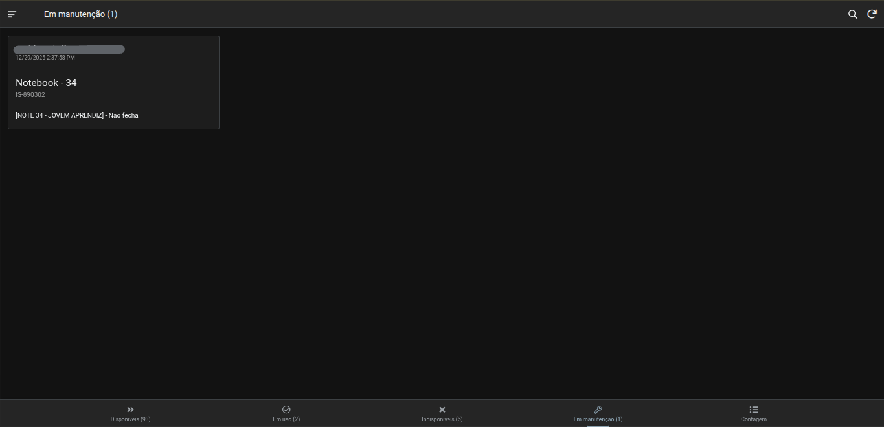
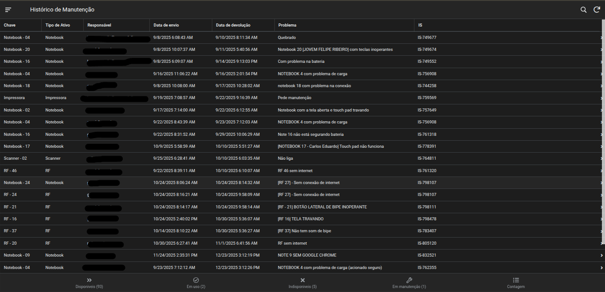

# Device Inventory Manager

## 📝 Overview
A professional **Asset Management** solution developed with **AppSheet** to centralize and automate the tracking of corporate hardware. This application was designed to provide real-time visibility into the lifecycle of laptops and handheld devices, replacing inefficient manual processes.

## 🎯 The Problem
Previously, device tracking was handled via basic Google Forms, which resulted in:
* **Operational Bottlenecks:** Significant time loss due to manual data reconciliation.
* **Audit Gaps:** Absence of structured inventory counts and history.
* **Lack of Traceability:** No historical data on device maintenance or specific user assignments.

## 🚀 Key Features
* **Lifecycle Management:** Real-time tracking of device states: `Available`, `In Use`, `Under Maintenance`, or `Unavailable`.
* **Inventory Audit Module:** Dedicated workflow for periodic physical counting and reconciliation.
* **Smart Categorization:** Custom data fields tailored for both Laptops and Handheld devices.
* **Simplified Check-in/Check-out:** A user-friendly interface for assigning devices to specific employees instantly.
* **Automated Analytics:** Instant dashboard for fleet availability and maintenance forecasting.

## 🛠️ Technical Stack & Architecture
* **Platform:** AppSheet (Google Cloud)
* **Backend:** Google Sheets (Relational structure)
* **Logic:** Advanced AppSheet expressions for dynamic filtering, security filters, and conditional formatting.
* **Automations:** Scheduled bots for inventory alerts and status-driven triggers.

## 📊 Business Impact
* **Data Integrity:** Achieved **100% accuracy** in asset location and user accountability.
* **Process Optimization:** Eliminated manual form reconciliation, saving hours of administrative work.
* **Full Accountability:** Implemented a robust audit trail for every asset within the organization.

---

## 📸 Visual Preview

### 🖥️ Device Status Management
* **Available Devices:** Overview of hardware currently ready for deployment.
    
  
* **In Use:** Real-time tracking of assets currently assigned to employees.
    
  
* **Under Maintenance:** Monitoring devices that are currently undergoing technical repairs.
    

### 📊 Operations & Records
* **Inventory Count:** Interface dedicated to the physical counting and auditing of devices.
    
  
* **Maintenance History:** A complete historical record of all previous technical interventions.
    
  
* **Sidebar:** The app's navigation menu for quick access to history and feedbacks.
    

---

## 👤 Author
**Lucas Araújo**
* LinkedIn: https://br.linkedin.com/in/lucas-ara%C3%BAjo-682016267
* Portfolio: [Link to your Portfolio]
