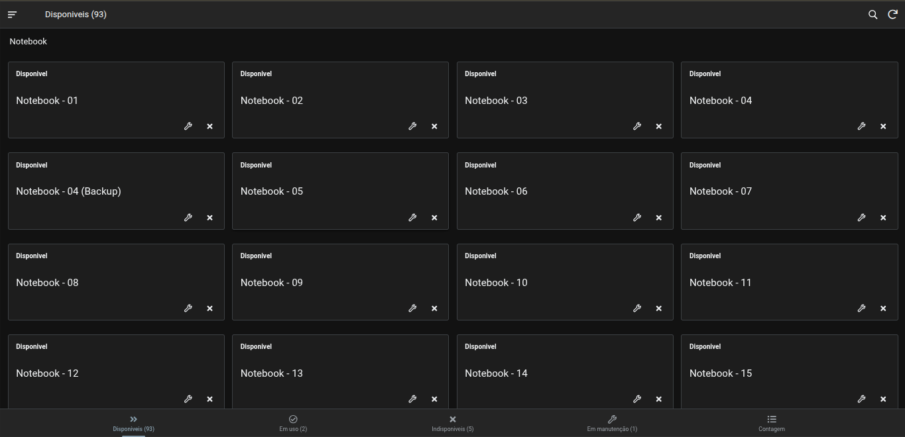
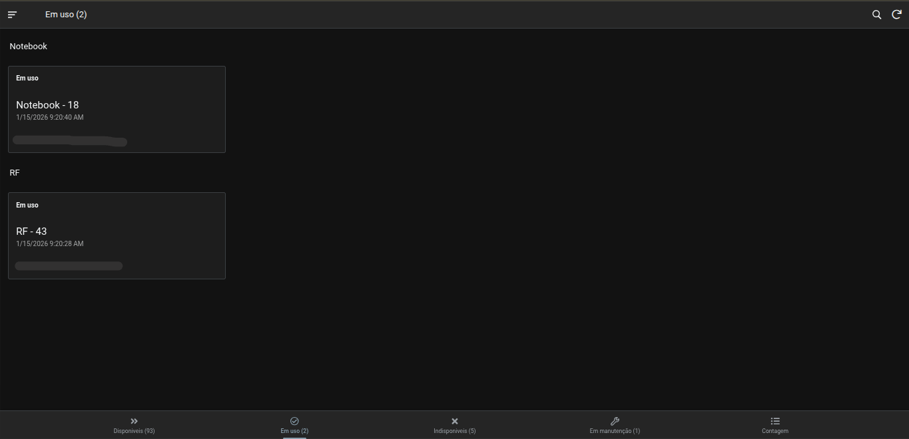
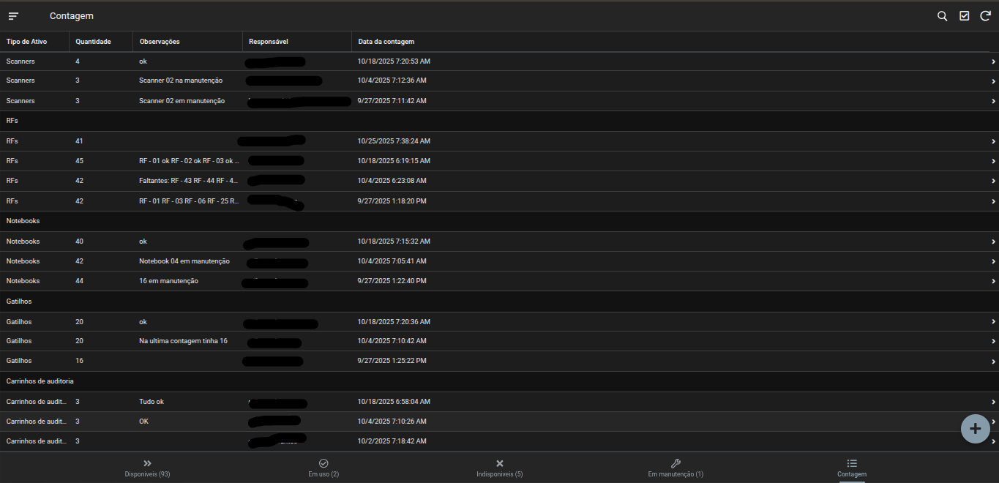
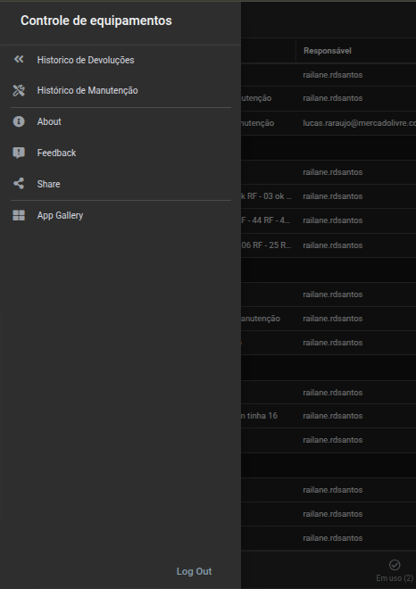

# Device Inventory Manager

## 📝 Overview
A professional **Asset Management** solution developed with **AppSheet** to centralize and automate the tracking of corporate hardware. This application was designed to provide real-time visibility into the lifecycle of laptops and handheld devices, replacing inefficient manual processes.

## 🎯 The Problem
Previously, device tracking was handled via basic Google Forms, which resulted in:
* **Operational Bottlenecks:** Significant time loss due to manual data reconciliation.
* **Audit Gaps:** Absence of structured inventory counts and history.
* **Lack of Traceability:** No historical data on device maintenance or specific user assignments.

## 🚀 Key Features
* **Lifecycle Management:** Real-time tracking of device states: `Available`, `In Use`, `Under Maintenance`, or `Unavailable`.
* **Inventory Audit Module:** Dedicated workflow for periodic physical counting and reconciliation.
* **Smart Categorization:** Custom data fields tailored for both Laptops and Handheld devices.
* **Simplified Check-in/Check-out:** A user-friendly interface for assigning devices to specific employees instantly.
* **Automated Analytics:** Instant dashboard for fleet availability and maintenance forecasting.

## 🛠️ Technical Stack & Architecture
* **Platform:** AppSheet (Google Cloud)
* **Backend:** Google Sheets (Relational structure)
* **Logic:** Advanced AppSheet expressions for dynamic filtering, security filters, and conditional formatting.
* **Automations:** Scheduled bots for inventory alerts and status-driven triggers.

## 📊 Business Impact
* **Data Integrity:** Achieved **100% accuracy** in asset location and user accountability.
* **Process Optimization:** Eliminated manual form reconciliation, saving hours of administrative work.
* **Full Accountability:** Implemented a robust audit trail for every asset within the organization.

---

## 📸 Visual Preview

### 🖥️ Core Views
This section shows the real-time status of the hardware fleet.
* **Available Devices:** Overview of all hardware currently ready for deployment.
    
* **Devices In-Use:** Real-time tracking of assets assigned to employees.
    

### 🛠️ Operations & Maintenance
Workflows designed for technical support and warehouse management.
* **Inventory Counting:** The interface for physical auditing and stock reconciliation.
    
* **Under Maintenance:** Tracking devices with technical issues or pending repairs.
    

### 📜 Navigation & Records
System structure and historical data tracking.
* **Navigation Sidebar:** Quick access to history, feedback, and app modules.
    
* **Maintenance History:** Full audit trail of past repairs and hardware interventions.
    

---

## 👤 Author
**Lucas Araújo**
* LinkedIn: https://br.linkedin.com/in/lucas-ara%C3%BAjo-682016267
* Portfolio: [Link to your Portfolio]
